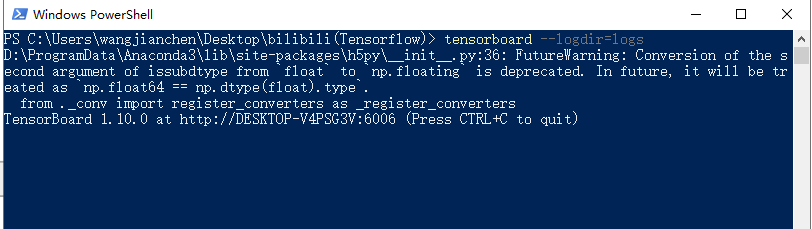
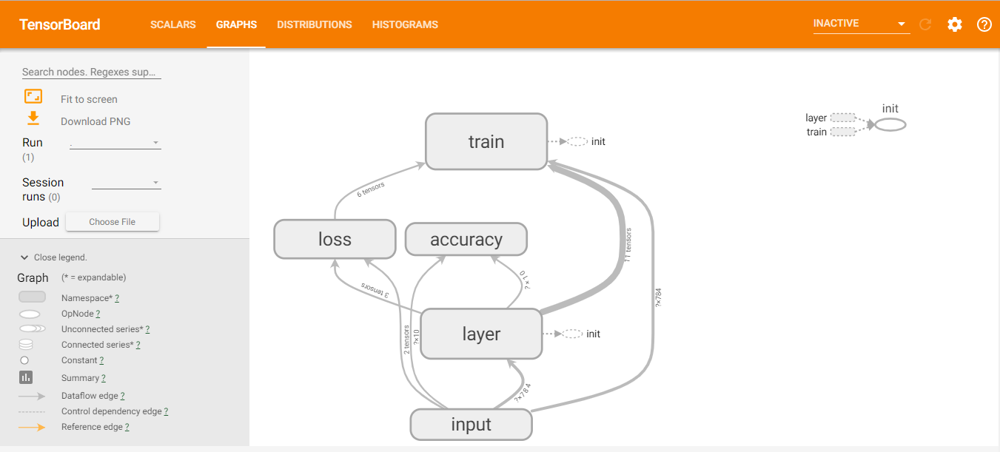
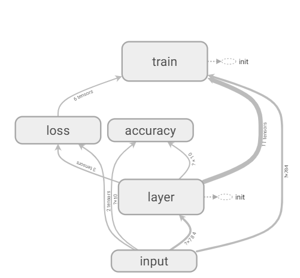
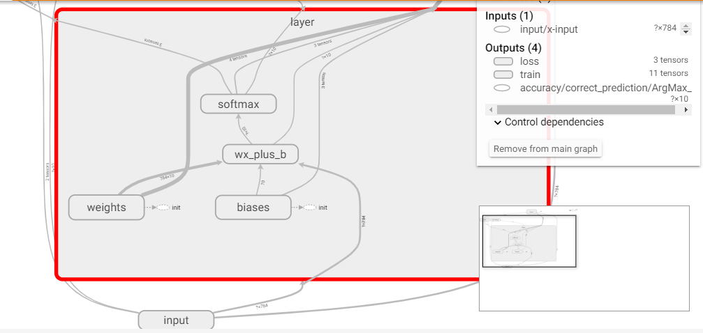
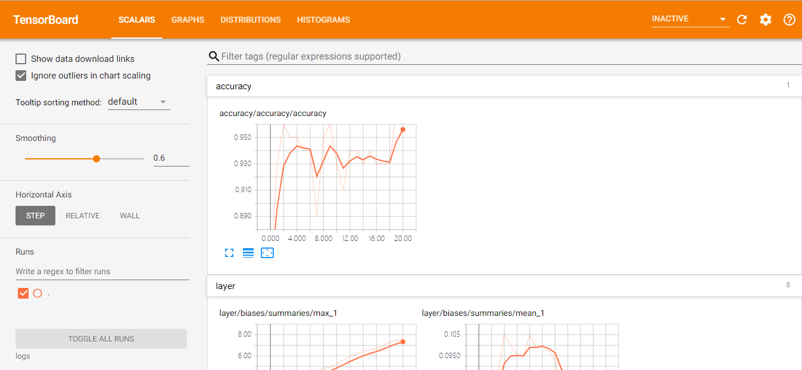
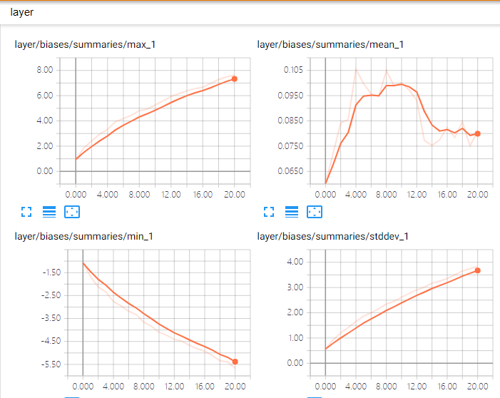
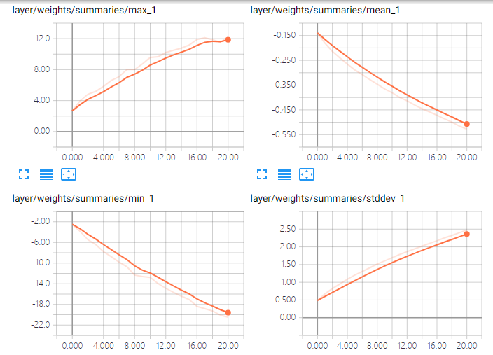
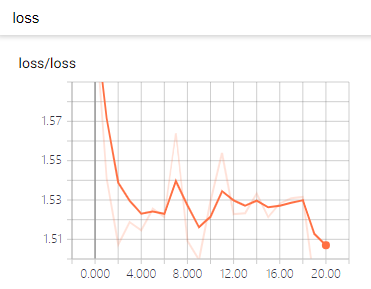

## tensorboard 可视化使用
* tf.name_scope():
* writer = tf.summary.FileWriter('logs/',sess.graph)
- cmd下打开使用
  * tensorboard --logdir=路径
  * 复制网址
  * 打开谷歌浏览器
  * 修改name_scope后，删除logs，Kernel-Restart and run all，重新运行tensorboard --logdir

---

### 以mnist数据集为例

```python
import tensorflow as tf
from tensorflow.examples.tutorials.mnist import input_data
import matplotlib.pyplot as plt
```

```python
mnist = input_data.read_data_sets('MNIST',one_hot=True)
print(mnist.train.images.shape)
print(mnist.train.labels.shape)
print(mnist.test.images.shape)
print(mnist.test.labels.shape)
```

```python
(55000, 784)
(55000, 10)
(10000, 784)
(10000, 10)
```

---

```python
#每个批次的大小（即一次传入图片的数量）
batch_size = 100
#计算一共有多少批次
n_batch = mnist.train.num_examples//batch_size

#参数分析(分析项目比较多，可以自行选择)
def variable_summaries(var):
    with tf.name_scope('summaries'):
        mean = tf.reduce_mean(var)
        tf.summary.scalar('mean',mean)#均值
        with tf.name_scope('stddev'):
            stddev = tf.sqrt(tf.reduce_mean(tf.square(var-mean)))
        tf.summary.scalar('stddev',stddev)#标准差
        tf.summary.scalar('max',tf.reduce_max(var))#max
        tf.summary.scalar('min',tf.reduce_min(var))#min
        tf.summary.histogram('histogram',var)#直方图

#定义两个placeholder
#命名空间
with tf.name_scope('input'):
    x = tf.placeholder(tf.float32,[None,784],name="x-input")
    y = tf.placeholder(tf.float32,[None,10],name="y-input")
```

```python
#创建一个最简单的神经网路
with tf.name_scope('layer'):
#layer1
    with tf.name_scope('weights'):
        W = tf.Variable(tf.zeros([784,10]),name='W')
        variable_summaries(W)
    with tf.name_scope('biases'):
        b = tf.Variable(tf.zeros([10]),name='b')
        variable_summaries(b)
    with tf.name_scope('wx_plus_b'):
        wx_plus_b = tf.matmul(x,W) + b
    with tf.name_scope('softmax'):
        prediction = tf.nn.softmax(wx_plus_b)
```

```python
#定义交叉熵代价函数
with tf.name_scope('loss'):
    loss = tf.reduce_mean(tf.nn.softmax_cross_entropy_with_logits_v2(logits=prediction,labels=y))
    tf.summary.scalar('loss',loss)
#使用梯度下降法
with tf.name_scope('train'):
    train_step = tf.train.AdamOptimizer(0.2).minimize(loss)
    
#求准确率
with tf.name_scope('accuracy'):
    with tf.name_scope('correct_prediction'):
        correct_prediction = tf.equal(tf.argmax(y,1),tf.argmax(prediction,1))#true or false(返回一维张量中最大的值所在的位置)
    with tf.name_scope('accuracy'):
        accuracy = tf.reduce_mean(tf.cast(correct_prediction,tf.float32))#true=1.0 false=0.0
        tf.summary.scalar('accuracy',accuracy)
```

```python
#初始化全局变量    
init = tf.global_variables_initializer()
gpu_options=tf.GPUOptions(per_process_gpu_memory_fraction=0.333)
        
#合并所有summary
merged = tf.summary.merge_all()

```

```python
with tf.Session(config=tf.ConfigProto(gpu_options=gpu_options)) as sess:
    sess.run(init)
    writer = tf.summary.FileWriter('logs/',sess.graph)
    for epoch in range(21):#训练21次循环
        for bach in range(n_batch):
            batch_xs,batch_ys = mnist.train.next_batch(batch_size)#获取下一批要传入的100张图片（一次100张图片，一共n_batch次）
            summary,_ = sess.run([merged,train_step],feed_dict={x:batch_xs,y:batch_ys}) #一边训练，一边反馈merge
            
        #输出    
        writer.add_summary(summary,epoch)   
        train_acc1 = sess.run(accuracy,feed_dict={x:batch_xs,y:batch_ys})
        train_acc2 = sess.run(accuracy,feed_dict={x:mnist.train.images,y:mnist.train.labels})
        test_acc = sess.run(accuracy,feed_dict={x:mnist.test.images,y:mnist.test.labels})
        print('iter:' + str(epoch) + '  train_acc1:'+ str(train_acc1) + '  train_acc2:'+ str(train_acc1) + '  test_acc:'+ str(test_acc))
       
```



`主界面`



`数据流图（graph）`



`展开layer`



`scalars`



`准确率`


```
iter:0  train_acc1:0.85  train_acc2:0.85  test_acc:0.9186
iter:1  train_acc1:0.94  train_acc2:0.94  test_acc:0.9253
iter:2  train_acc1:0.97  train_acc2:0.97  test_acc:0.923
iter:3  train_acc1:0.95  train_acc2:0.95  test_acc:0.9224
iter:4  train_acc1:0.96  train_acc2:0.96  test_acc:0.9256
iter:5  train_acc1:0.94  train_acc2:0.94  test_acc:0.9259
iter:6  train_acc1:0.94  train_acc2:0.94  test_acc:0.916
iter:7  train_acc1:0.91  train_acc2:0.91  test_acc:0.9247
iter:8  train_acc1:0.96  train_acc2:0.96  test_acc:0.9277
iter:9  train_acc1:0.96  train_acc2:0.96  test_acc:0.9243
iter:10  train_acc1:0.94  train_acc2:0.94  test_acc:0.9245
iter:11  train_acc1:0.91  train_acc2:0.91  test_acc:0.9281
iter:12  train_acc1:0.94  train_acc2:0.94  test_acc:0.9316
iter:13  train_acc1:0.94  train_acc2:0.94  test_acc:0.9276
iter:14  train_acc1:0.94  train_acc2:0.94  test_acc:0.9275
iter:15  train_acc1:0.94  train_acc2:0.94  test_acc:0.9288
iter:16  train_acc1:0.94  train_acc2:0.94  test_acc:0.9282
iter:17  train_acc1:0.93  train_acc2:0.93  test_acc:0.9285
iter:18  train_acc1:0.93  train_acc2:0.93  test_acc:0.9301
iter:19  train_acc1:0.98  train_acc2:0.98  test_acc:0.9294
iter:20  train_acc1:0.97  train_acc2:0.97  test_acc:0.9319
```

`bias的四个量变化`



`weights`



`loss曲线`


